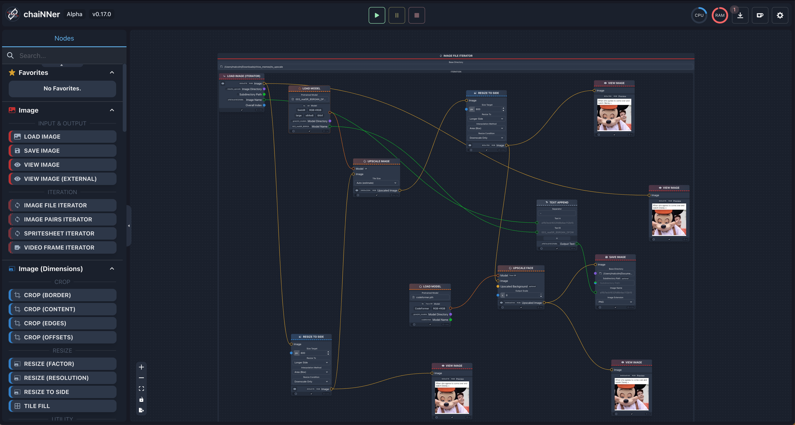

# chaiNN-hub
Repository full of .chn (chain) templates for https://github.com/chaiNNer-org/chaiNNer

# In this repo

### **dir_itr_upscale_with_real_people_faces_downscale_first_800**

    Attempts to downscale image prior to performing upscale on it. In the future, this should be able to read from the transformations the model was trained on and try to scale it to that prior to upscaling image. Iterates through directory.

# Other resources

* https://github.com/Kim2091/kim-chaiNNer-Templates - A collection of useful chain templates that can quickly get you started if you are still new to using chaiNNer.